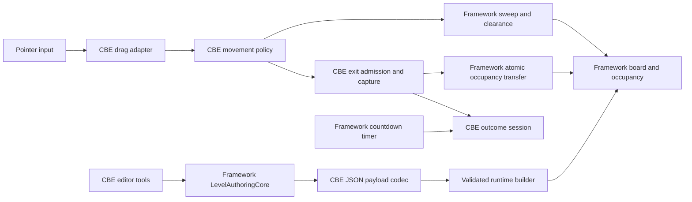
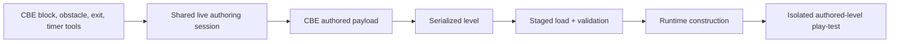

# Color Block Escape

Color Block Escape is a playable Unity puzzle prototype built on
[Puzzle Framework](https://github.com/GameplaySystem/PuzzleFramework). The player freely drags
fixed-orientation, multi-cell blocks across a board and sends each block through a matching colored
exit before the countdown ends. The project is the second framework consumer and proves that the
shared movement, occupancy, runtime-flow, board-presentation, and authoring systems work beyond
Drop The Man.

## Key Features

- continuous free dragging of fixed-orientation multi-cell and irregular block footprints
- board-boundary, inactive-cell, blocked-cell, and occupied-footprint collision
- swept traversal that prevents fast pointer movement from tunnelling through blockers
- matching-color exit admission with aperture-span and tunable alignment checks
- collision-free alignment before capture, locked player control, and per-exit busy state
- controlled outward exit movement with progressive logical occupancy release
- countdown loss, all-blocks-cleared completion, and final-acceptance precedence at an exact tie
- runtime outcomes independent from exit or future chipper presentation timing
- JSON payload codec plus validated runtime construction
- a play-mode level editor built on the shared live framework authoring session
- modular board visuals reused from DTM with validated exit wall openings
- editor-to-runtime play-test handoff using the same construction and gameplay path

## Gameplay / Demo

The current gameplay path starts from the level editor:

1. Open `Assets/Scenes/ColorBlockEscapeLevelEditor.unity`.
2. Enter Play Mode.
3. Author at least one block, one valid matching exit, and a positive timer.
4. Select **Play-test authored level** in the editor HUD.
5. Drag blocks with the primary mouse button.

`Assets/Scenes/PlainMovementCheckpoint.unity` remains a diagnostic scene for plain movement. It
does not include exit admission or outcomes and is not the main gameplay demo.

## Architecture Overview

| System | Responsibility |
| --- | --- |
| Framework board and occupancy | Stores board cells, footprints, current occupancy, wall facts, and world/grid layout. |
| Framework interaction | Projects the pointer to the board and provides sweep, clearance, snap, and atomic occupancy-transfer primitives. |
| CBE movement policy | Decides valid continuous block travel using the shared geometry and occupancy facts. |
| CBE exit capture | Owns color matching, span fit, alignment threshold, corridor clearance, busy exits, capture, and progressive release. |
| Runtime flow | Uses framework timer/game-state services while CBE owns completion, timeout, and exact-tie precedence. |
| Level data and construction | Framework transports generic level data; CBE interprets block, exit, color, footprint, and timer payloads. |
| Presentation | Framework builds modular board cells; CBE chooses exit openings and currently renders placeholder block/exit geometry. |
| Level editor | Shared live authoring core plus CBE-specific block, obstacle, exit, timer, codec, and play-test tools. |

## Architecture Diagram



Framework services answer generic questions such as whether a footprint can traverse or occupy a
set of cells. CBE decides whether a colored block can use an exit, when control locks, when
occupancy is released, and which outcome wins. The diagram keeps that gameplay data flow readable
without exposing every repository dependency.

## Framework vs. Game-Specific Code

| Reusable Puzzle Framework | Color Block Escape |
| --- | --- |
| coordinates, cell states, footprints, occupancy, and walls | blocks, colored exits, and their gameplay meaning |
| pointer projection, sweep, clearance, snap, atomic transfer | free-drag policy and exit capture/alignment policy |
| generic level envelope and construction context | CBE payload codec, validation, and runtime builder |
| timer and game-state lifecycle | all-blocks-cleared win, timeout loss, and exact-tie precedence |
| color identity and modular board planning | block/exit colors, visual openings, future chipper presentation |
| authoring session, picking, placement, selection, move, rotation, erase | block presets, obstacle policy, exit fields, timer tools, play-test handoff |

The framework never contains CBE nouns or exit rules. CBE consumes package contracts through its
own runtime and authoring assembly.

## Reusable Systems Demonstrated

Color Block Escape is the second use case that justified promoting swept-footprint movement,
structural/occupancy clearance, atomic footprint transfer, explicit grid anchoring, and the live
authoring core into Puzzle Framework.

The shared systems are exercised differently from DTM:

- DTM moves capacity-bearing holes and collects matching cats; CBE moves solid blocks and rejects
  occupied cells.
- DTM uses center-anchored editor picking; CBE uses corner anchoring to match its unit-square
  runtime coordinates.
- DTM warns and prunes on resize; CBE rejects structural edits that would invalidate content.
- Both build the same configured modular board prefab, while CBE hides validated wall segments for
  exits through a presentation-only framework API.

## Level Creation / Editor Tooling

The editor uses one authoritative live `LevelAuthoringCore` plus CBE-owned block and exit data.

| Input | Action |
| --- | --- |
| `B` | block placement |
| `M` | select/move block |
| `O` | toggle Active/Blocked obstacle state |
| `E` | place/edit exit |
| `S` | select exit |
| `0`–`9` | select a shared color slot |
| Mouse wheel | cycle block footprint presets while over the board |
| Left click | apply the selected authoring action |
| Right click | erase in block or exit placement mode |

The HUD also exposes board resize, block recolor and rotation, exit side/start/width/color fields,
timer settings, JSON save/load, and play-test. Invalidating structural edits are rejected and
report the content that prevents the change.



Editor preview objects do not become gameplay authority. Play-test builds a fresh runtime level
through the same codec, validation, and construction path used by loaded data.

## Technical Decisions

1. **Exit rules remain game-owned.** Boundary-edge picking is reusable; colored exit admission,
   alignment, busy state, and progressive release are specific to CBE.
2. **Continuous movement uses logical footprints.** Geometry and occupancy decide travel, allowing
   irregular shapes without coupling gameplay to a particular mesh.
3. **Capture and presentation are separate.** Successful admission locks the gameplay result;
   future chipper animation cannot decide or reverse it.
4. **Occupancy changes are atomic.** Alignment may acquire and release required in-board cells
   safely; strictly outward travel only releases occupancy.
5. **The editor consumes the shared live session.** CBE did not copy DTM's editor or build a second
   generic-looking authoring core inside the game module.

## Performance Considerations

- Movement and exit collision use board/footprint queries rather than Rigidbody simulation.
- One drag adapter processes pointer input; block views do not each run an independent gameplay
  `Update` loop.
- Runtime logic is plain C# and remains independent from DOTween.
- The planned chipper fragment pool and DOTween scattering presentation are not implemented yet and
  are not claimed as an optimization.
- No mobile frame-time, allocation, or memory benchmark is published yet.

## Project Structure

```text
Assets/
  GameModules/
    Runtime/
      Authoring/             CBE editor session, tools, controller, views
      ColorBlockEscape*.cs   Payload, construction, capture, outcome
      PlainBlock*.cs         Continuous movement and scene adapter
    Tests/
      EditMode/              Movement, construction, capture, outcome, editor
      PlayMode/              Scene movement and authored play-test coverage
  RuntimeAssets/Board/       Reused configured modular board assets
  Scenes/
    ColorBlockEscapeLevelEditor.unity
    PlainMovementCheckpoint.unity
Packages/
  manifest.json             Immutable Puzzle Framework dependency
```

## Technologies

- Unity `6000.3.17f1`
- C#
- Universal Render Pipeline `17.3.0`
- Unity Input System `1.19.0`
- Unity Test Framework `1.6.0`
- Puzzle Framework pinned through Unity Package Manager to a full Git commit SHA
- DOTween is installed for the later presentation checkpoint; current gameplay does not depend on it

## Current Status

Completed checkpoints:

- framework-backed continuous block movement
- shared editor adoption and authored-level play-test
- matching-color exit capture and progressive occupancy release
- timer and outcome integration
- keyboard-focused authoring workflow and DTM modular-board reuse

In progress or deferred:

- owner-authored basic-shape block prefabs for editor/runtime views
- chipper and fragment-scatter presentation
- pooling for chipper fragments
- final UI, tuning, and mobile/device validation

The current CBE verification passes **37/37 Edit Mode tests** and **4/4 Play Mode tests**.

## What I Built / Role

This is my independent portfolio engineering project. I designed and directed the CBE gameplay
architecture, reviewed and integrated implementations, built and debugged movement, exit, outcome,
and editor systems, and own the framework integration, validation strategy, and documentation.

## Running the Project

1. Clone the repository.
2. Open it with Unity `6000.3.17f1`.
3. Allow Unity Package Manager to resolve the pinned Puzzle Framework revision.
4. Open `Assets/Scenes/ColorBlockEscapeLevelEditor.unity`.
5. Enter Play Mode, author a valid block/exit pair, and choose **Play-test authored level**.

Git must be installed and available to Unity. The project does not require a neighboring framework
checkout because `Packages/manifest.json` pins the published package revision.

Run tests through **Window > General > Test Runner**, using both EditMode and PlayMode.

## Design Documentation

The approved requirements and designs currently live in the framework repository:

- [CBE MVP requirements](https://github.com/GameplaySystem/PuzzleFramework/blob/main/docs/ColorBlockEscapeMVPRequirements.md)
- [CBE runtime design](https://github.com/GameplaySystem/PuzzleFramework/blob/main/docs/ColorBlockEscapeRuntimeTechnicalDesign.md)
- [CBE editor design](https://github.com/GameplaySystem/PuzzleFramework/blob/main/docs/ColorBlockEscapeEditorTechnicalDesign.md)
- [Framework architecture](https://github.com/GameplaySystem/PuzzleFramework/blob/main/docs/FrameworkArchitecture.md)
